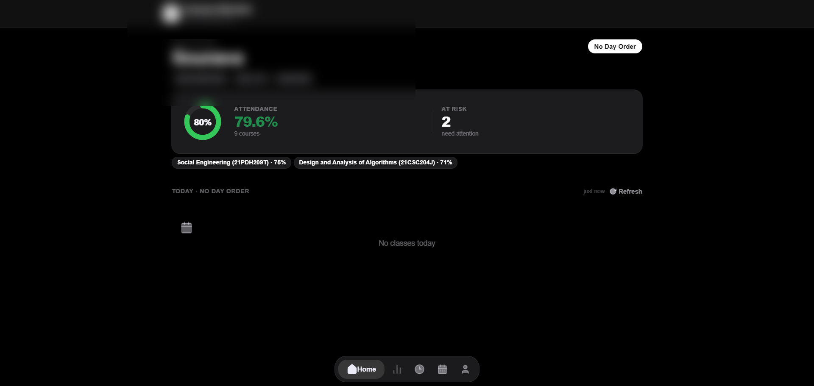
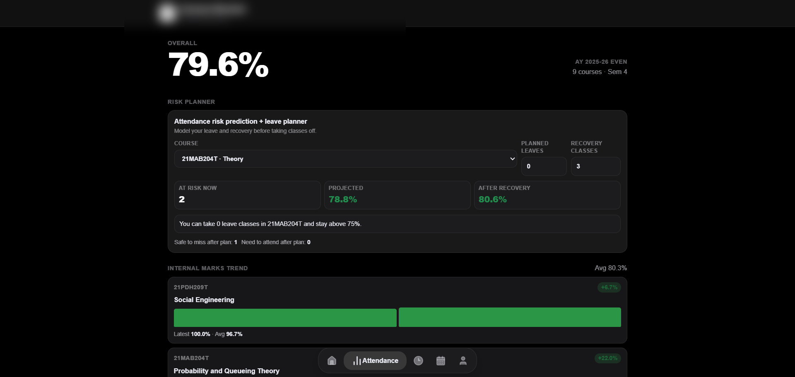
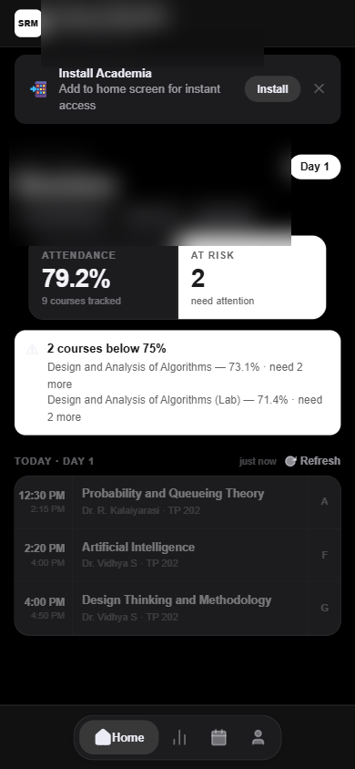

<div align="center">
  
  <h1>Arch</h1>
  <p><strong>Fast, compact, mobile-first remake of SRM Academia</strong></p>
</div>

<div align="center">
  
  
  
  
  
  
</div>

## Why Arch is better for daily use

Arch is built to outperform the legacy portal experience on mobile.  
The focus is fast access, fewer taps, higher information density, and stronger session reliability.

- Mobile-first interaction model with compact layouts that reduce scrolling and navigation friction.
- Real login and data pipeline (`/auth`, `/proxy`) with trusted-session handling and automatic session validation.
- Actionable attendance UX: risk visibility, leave planning, marks trend, and day-order aware timetable context.
- Installable PWA workflow with update prompts, offline resilience, and post-install attendance alert support.

## Core features

- Live attendance, internal marks, timetable, academic calendar, and full profile surfaces.
- Adaptive attendance watcher that automatically changes fetch frequency by class activity and day type.
- Attendance change notifications in installed PWA mode (present, absent, updated).
- Profile tab notification badge with lightweight unread polling.
- Ten-theme appearance system with dark-first visual polish and safe-area mobile handling.
- Startup self-heal path for stale cache/service-worker edge cases.

## Latest sanitized screenshots

> Email-like identifiers are intentionally blurred.

| Home | Attendance | Mobile home |
| --- | --- | --- |
|  |  |  |

## Quick start

```bash
npm install
npm run dev
```

Useful scripts:

- `npm run dev` → backend + frontend
- `npm run dev:vite` → frontend only
- `npm run build` → production build
- `npm run lint` → eslint checks

## Core stack

- Frontend: React + TypeScript + Vite + Framer Motion
- Backend: Express + Axios cookie-jar auth proxy
- PWA: `vite-plugin-pwa`

## Local-first + canary workflow

- Work locally on `feature/*` branches with `npm run dev`.
- Merge tested features into `canary` first (staging/integration).
- Promote `canary` to `main` only after verification.
- Keep Netlify production on `main`; enable branch deploys for `canary`.

## Render backend env vars (required/recommended)

- `REDIS_URL` (recommended): enables persistent server sessions and reduces random logout after restarts.
- `SRM_TLS_INSECURE` (optional, default unset): set to `1` only if SRM TLS chain fails in your environment.
- `ADMIN_USER` (optional, default `as6977`): admin account allowed for metrics endpoint.
- `ADMIN_METRICS_TOKEN` (recommended): required for `/auth/admin/metrics` access.
- `WEB_PUSH_PUBLIC_KEY` (required for closed-app push subscribe): VAPID public key.
- `WEB_PUSH_PRIVATE_KEY` (required for sender worker rollout): VAPID private key.
- `WEB_PUSH_SUBJECT` (required for sender worker rollout): contact URI like `mailto:you@example.com`.

## Admin active-user metrics

Primary UX:

- Logged in as `as6977`, open **Profile** tab to view:
  - active user count
  - active session count
  - push subscription count
  - session store mode

API options (for backend ops/testing):

Option A (header-token protected endpoint):

```bash
curl -H "x-admin-user: as6977" -H "x-admin-token: <ADMIN_METRICS_TOKEN>" https://<render-service>.onrender.com/auth/admin/metrics
```

Option B (session-auth endpoint, only for `as6977` login):

```bash
curl -H "x-session-token: <academia_session_token>" https://<render-service>.onrender.com/auth/admin/metrics/self
```

Returns active session count, unique active users, per-user session stats, and recent auth/logout events.

## In-app version & changelog

- Profile includes a **Cooking** option for all users.
- Tapping **Cooking** opens a dedicated black-background changelog page.
- Version rows are expandable and show short `Added / Improved / Removed` notes.

## Storage hygiene and garbage cleanup

- Per-user tab cache (`arch.tabcache.v1.*`) now has:
  - schema versioning
  - max-age expiry (21 days)
  - automatic cleanup of stale/invalid entries
- On login, cache from other users is removed.
- On logout, current user cache + attendance snapshot are removed.

This prevents uncontrolled localStorage growth while keeping fast startup for the active user.

## Uptime strategy

- Render free web services can sleep when idle.
- For stable always-on sessions, use a paid always-on Render instance + Redis.
- If free tier is kept, occasional re-auth after idle/restart is expected.

## Closed-app push subscription beta (internal)

Authenticated endpoints:

- `GET /auth/push/status` → rollout phase + requirements + `subscriptionStored`
- `GET /auth/push/public-key` → VAPID public key for `PushManager.subscribe`
- `POST /auth/push/subscription` → stores subscription payload for logged-in user
- `DELETE /auth/push/subscription` → removes stored subscription for logged-in user

Current phases:

- `design-only` when VAPID env vars are incomplete
- `subscription-ready` when keys are configured but this account has not subscribed yet
- `subscription-stored` when this account is already subscribed

What is done now:

- Backend endpoints exist for internal testing.
- Backend stores subscriptions in Redis when `REDIS_URL` exists, otherwise in memory.
- Admin metrics and `/auth/health` include push subscription counts.
- Attendance alert enable flow now auto-attempts closed-app push subscription when browser/device support + VAPID config are present.

UI note:

- Closed-app push has no separate user-facing section; it is integrated under Attendance Alerts.

Still pending for full delivery:

- sender worker that dispatches web push payloads on attendance deltas
- automatic cleanup for expired push endpoints (410/404 invalidation)

## Speed and performance engineering

- Adaptive polling strategy:
  - active class: 20s
  - between classes: 60s
  - off-hours: 7m
  - idle day (no class windows): 15m
  - weekend: 25m
  - hidden tab safety floor: 3m
- Heavy chart surface is lazy-loaded so first render stays fast.
- Workbox runtime caching keeps documents, assets, and media responsive under unstable networks.
- Vendor chunk splitting keeps initial route payload smaller and improves cache reuse across updates.
- Day-order refresh is throttled and decoupled from every attendance request.
- PWA startup recovery clears broken stale cache states to avoid blank-shell regressions.

